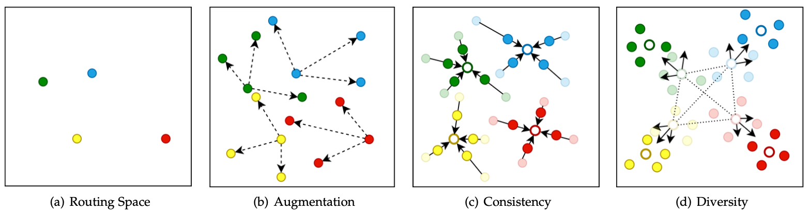
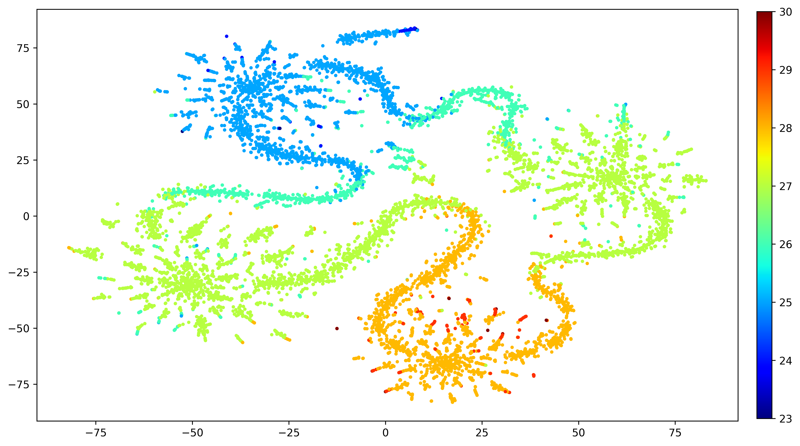

# CoDiNet

This contains the PyTorch implementation of the CoDiNet papers,

CoDiNet: Path Distribution Modeling with Consistency and Diversity for Dynamic Routing, TPAMI 2021.

By Huanyu Wang, Zequn Qin, Songyuan Li, Xi Li.

## Abstract 
Dynamic routing networks, aimed at finding the best routing paths in the networks, have achieved significant improvements to neural networks in terms of accuracy and efficiency. In this paper, we see dynamic routing networks in a fresh light, formulating a routing method as a mapping from a sample space to a routing space. From the perspective of space mapping, prevalent methods of dynamic routing did not take into account how routing paths would be distributed in the routing space. Thus, we propose a novel method, termed CoDiNet, to model the relationship between a sample space and a routing space by regularizing the distribution of routing paths with the properties of consistency and diversity. In principle, the routing paths for the self-supervised similar samples should be closely distributed in the routing space. Moreover, we design a customizable dynamic routing module, which can strike a balance between accuracy and efficiency. When deployed upon ResNet models, our method achieves higher performance and effectively reduces average computational cost on four widely used datasets. 

## Keywords 
Routing space mapping, distribution of routing paths, the consistency regularization, the diversity regularization, dynamic routing

[Paper-arxiv](https://arxiv.org/abs/2005.14439)

Figure: Visualization for the distribution of routing paths within CoDiNet.

## Usage
    python -m torch.distributed.launch --nproc_per_node=$NGPUS train_cifar.py --dataset cifar10 --backbone resnet20 --train_bs 60 --aug_repeat 1 --test_bs 100 --lr 0.1 --epochs 60 --beta 25 --loss_w 0.0 --num_target 16 --log_path ./outputs/imagenet --note your_note

### Disclamer

We based our code on [Convnet-AIG](https://github.com/andreasveit/convnet-aig), please go show some support!
